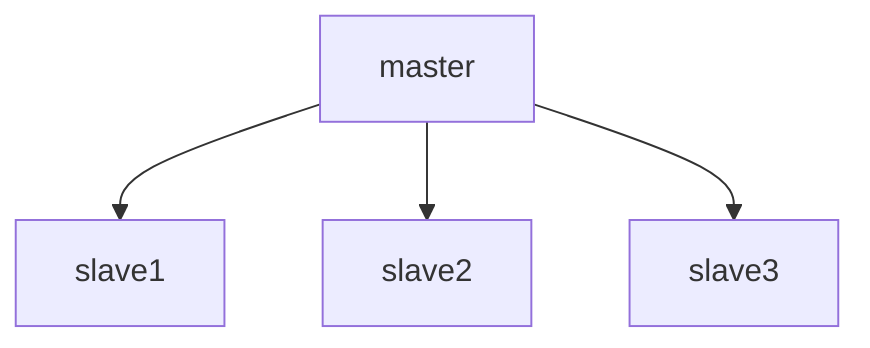

# What is configuration management?
configuration management is managing multiple servers or infrastructure.
Configuration Management in DevOps is a systematic process that helps organizations maintain and control their IT systems, infrastructure, and software in a desired, consistent state. It involves managing and tracking changes to system configurations, ensuring that all environments (development, staging, production) remain consistent and reliable.


# Ansible v/s puppet
## Ansible:-
1. arch :- Ansible is a push based mechanism model, means:- write once playbook and can push all instances to execute configs on all instances
2. it is agentless like put all names all servers/ip-addresses/dns-names in inventory or also passwordless authentication enabled and write playbook and execute configuration on all servers or instances
3. easy with both windows or linux 
4. its simple, write configuration in yaml(scripting)


## puppet:-
1. arch:- Puppet is a pull based mechanism model
2. it is master/slave architecture model, like e.g,

3. sometimes it becomes tricky to use
4. write configuration in puppet language

# Setting up password-less authentication

method 1:-
```bash
ssh-copy-id private-ip-address-of-server # it works many times but we not use because of it has not all permissions to access all commands for other servers
```
+ ssh algo.:-
```bash
ssh-keygen -t rsa -b 4096
ssh-keygen -t dsa 
ssh-keygen -t ecdsa -b 521
ssh-keygen -t ed25519
```

method 2:-
```bash
ssh-keygen -t rsa -b 4096
# after running it will creates public key or private key
# got to the followed location 
cat /home/ubuntu/.ssh/id_rsa.pub
```
## After generating keys:
- After Genrating keys then display public key and copy the open all of the servers which you want to automate or configure automatically vreate a file in following path ```bash vim ~/.ssh/authorized_keys ``` and then paste the public key of the master server for making access to take password-less authentication for ansible.
- After getting password-less authentication then check once ``` ssh private ip-address```. then you can make an inventory file where all of the configs of all servers like all servers private ip-address, web-server ip-address, batabases ip config or dns etc following by [servers], [web-servers], [databases] etc.
- After completing inventory start to write ansible-playbook, extension of ansible palybook is .yml whole script written in .yml file. Executing ansible-plabook command is ```ansible-playbook -i inventory playbookname.yml```.
- check all ip-address ping or not then run ```bash ansible all -m ping -u root ```
